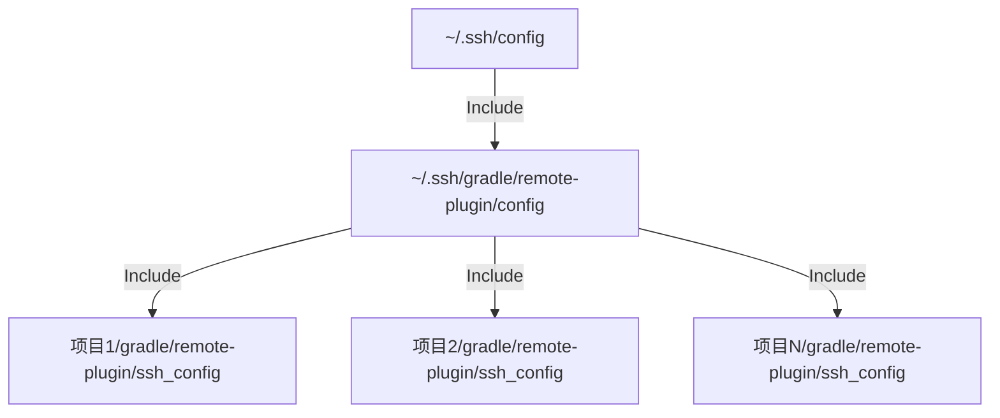
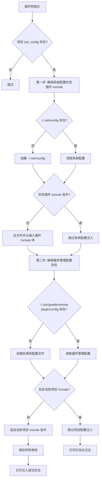
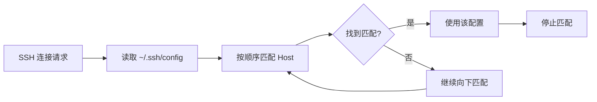

# SSH 配置文件自动管理功能设计

## 需求概述

在 Gradle Remote Plugin 中添加 SSH 配置文件管理能力，使项目能够自带 SSH 配置并在插件初始化时自动将配置注入到系统的 SSH config 文件中，实现不同项目不同配置、开箱即用的效果。

## 核心目标

- 支持在项目中定义独立的 SSH 配置文件
- 插件初始化时自动检测并注入配置到系统 SSH config
- 配置文件可随项目一起进行版本管理
- 避免手动修改系统配置，降低配置错误风险

## 设计方案

### 1. SSH 配置文件位置与结构

采用两层 Include 结构，便于统一管理和扩展：

**配置文件层级**



**文件路径说明**

|文件|路径|作用|
|---|---|---|
|系统 SSH 配置|~/.ssh/config|用户主配置文件，Include 插件管理配置|
|插件管理配置|~/.ssh/gradle/remote-plugin/config|汇总所有项目的 SSH 配置|
|项目 SSH 配置|<项目根目录>/gradle/remote-plugin/ssh_config|单个项目的 SSH 配置|

**项目配置示例参考**

|配置项|说明|示例值|
|---|---|---|
|Host|SSH 主机别名|cloudflared.fa.internet.company|
|HostName|实际主机地址|ssh-fa-ssy-edgeone-cn.iuin888vip.icu|
|User|登录用户|root|
|IdentityFile|私钥文件路径|~/.ssh/id_ed25519_iu|
|ProxyCommand|代理命令|cloudflared access ssh --hostname %h --protocol quic|

### 2. 自动注入机制

#### 2.1 注入时机

在 RemotePlugin 的 apply 方法中，完成插件配置扫描后、注册任务前执行 SSH 配置检查和注入逻辑。

#### 2.2 注入流程



#### 2.3 第一层注入：系统配置

在系统 `~/.ssh/config` 文件开头插入以下内容（仅首次）：

**注入内容格式**
```
# Auto-generated by Gradle Remote Plugin
# DO NOT EDIT THIS BLOCK MANUALLY
Include ~/.ssh/gradle/remote-plugin/*

```

**注入说明**
- 使用通配符 `*` 引用插件管理目录下的所有配置文件
- 添加注释说明这是插件自动生成的配置
- 前后添加空行与其他配置隔开

#### 2.4 第二层注入：插件管理配置

在 `~/.ssh/gradle/remote-plugin/config` 文件中追加项目配置引用：

**文件内容格式**
```
# Gradle Remote Plugin - Managed SSH Configurations
# This file is auto-generated and managed by the plugin

# Project: <项目名>
# Path: <项目绝对路径>
Include <项目根目录绝对路径>/gradle/remote-plugin/ssh_config

# Project: <其他项目名>
# Path: <其他项目绝对路径>
Include <其他项目根目录绝对路径>/gradle/remote-plugin/ssh_config

```

**追加规则**
- 每个项目占用独立的配置块
- 包含项目名称和路径的注释
- Include 指令使用项目 ssh_config 的绝对路径
- 配置块之间用空行隔开

#### 2.5 重复检测逻辑

**系统配置层面**
- 检查 `~/.ssh/config` 是否包含 `Include ~/.ssh/gradle/remote-plugin/*` 行
- 匹配时忽略空格差异

**项目配置层面**
- 检查 `~/.ssh/gradle/remote-plugin/config` 是否包含指向当前项目 ssh_config 的 Include 指令
- 检测条件：Include 行包含当前项目 ssh_config 的绝对路径

### 3. 配置管理方式

#### 3.1 版本控制

|文件|建议管理方式|说明|
|---|---|---|
|remote.yml|纳入 Git 管理|环境配置可共享|
|ssh_config|可选择性管理|包含敏感信息时可添加到 .gitignore；通用配置可提交|

#### 3.2 配置灵活性

- 每个项目维护独立的 ssh_config 文件
- 不同项目的配置互不干扰
- 支持多项目同时使用不同的 SSH 配置

### 4. 错误处理与边界情况

#### 4.1 文件权限处理

|场景|处理策略|
|---|---|
|无法读取 ~/.ssh 目录|捕获异常，打印警告信息，跳过注入|
|无法写入 ~/.ssh/config|捕获异常，打印错误信息及原因，提示用户手动处理|
|项目 ssh_config 不可读|打印警告，跳过注入|

#### 4.2 配置冲突预防

|场景|处理策略|
|---|---|
|项目 ssh_config 文件不存在|跳过注入流程，不报错|
|系统 config 文件不存在|自动创建文件及目录（设置权限 600）|
|Include 指令已存在|跳过注入，避免重复|

#### 4.3 SSH Config 规范校验

不在插件中进行 SSH 配置语法校验，由 SSH 客户端负责配置有效性检查。插件仅负责文件内容的读取和 Include 指令的注入。

### 5. 用户文档更新

#### 5.1 README 文档补充

在 README.md 和 README_CN.md 中新增 SSH 配置管理章节，说明以下内容：

**配置说明要点**

|内容项|描述|
|---|---|
|配置文件位置|gradle/remote-plugin/ssh_config|
|自动注入说明|插件初始化时自动将配置注入到 ~/.ssh/config|
|Host 重复警告|提醒用户不要在 ssh_config 中配置与系统其他配置重复的 Host 名称|
|配置冲突说明|SSH 使用第一个匹配的 Host 配置，重复配置会导致后面的配置不生效|
|版本管理建议|根据团队需求选择是否将 ssh_config 纳入 Git 管理|

#### 5.2 示例配置提供

在文档中提供 ssh_config 示例配置模板，帮助用户快速上手。

### 6. 实现要点

#### 6.1 配置文件路径解析

- 项目 ssh_config 使用绝对路径
- 支持用户主目录符号（~）的展开
- Include 指令中使用绝对路径以确保跨目录访问正常

#### 6.2 文件操作原子性

- 读取配置文件时使用完整内容读取
- 修改时先写入临时文件，验证无误后替换原文件
- 发生异常时保持原配置文件不变

#### 6.3 日志输出规范

|场景|日志级别|日志内容|
|---|---|---|
|跳过注入（文件不存在）|INFO|项目未配置 ssh_config，跳过 SSH 配置注入|
|系统配置已包含插件 Include|INFO|系统 SSH 配置已包含 Gradle Remote Plugin 引用|
|系统配置注入成功|INFO|已将 Gradle Remote Plugin 配置引用注入到 ~/.ssh/config|
|项目配置已存在|INFO|插件管理配置已包含当前项目，跳过注入|
|项目配置注入成功|INFO|已将项目 SSH 配置添加到插件管理配置中|
|注入失败|WARN/ERROR|无法注入 SSH 配置，原因：<具体错误信息>|

#### 6.4 多项目场景支持

- 每个项目独立管理自己的 ssh_config
- 系统 ~/.ssh/config 只包含一次插件 Include 指令
- 所有项目配置统一在 ~/.ssh/gradle/remote-plugin/config 中管理
- 新项目配置追加在插件管理配置文件末尾
- 通过集中管理避免系统配置文件被频繁修改

### 7. 配置优先级说明

SSH 配置匹配遵循"首次匹配"原则：



**重要提醒**：
- 项目 ssh_config 通过 Include 指令在文件开头引入
- 项目配置优先级高于系统配置中的后续 Host 定义
- 避免在不同项目的 ssh_config 中定义相同的 Host 名称
- 发生 Host 名称冲突时，以最先匹配到的配置为准

### 8. 安全考虑

#### 8.1 文件权限控制

|文件|推荐权限|说明|
|---|---|---|
|~/.ssh/config|600（rw-------）|仅所有者可读写|
|项目 ssh_config|600 或 644|视团队共享需求而定|
|~/.ssh 目录|700（rwx------）|仅所有者可访问|

#### 8.2 敏感信息处理

- 私钥文件路径（IdentityFile）应使用绝对路径或 ~ 符号
- 建议将私钥文件本身添加到 .gitignore
- 如 ssh_config 包含敏感主机信息，建议不纳入版本管理

### 9. 测试场景

#### 9.1 基础功能测试

|测试场景|预期结果|
|---|---|
|首次运行插件，项目有 ssh_config|系统配置和插件管理配置都正确注入|
|再次运行插件|检测到已存在，不重复注入|
|项目无 ssh_config|跳过注入，不报错|
|~/.ssh 目录不存在|自动创建目录和配置文件|
|~/.ssh/gradle/remote-plugin 目录不存在|自动创建目录和 config 文件|

#### 9.2 边界场景测试

|测试场景|预期结果|
|---|---|
|~/.ssh/config 文件为空|成功注入插件 Include 指令|
|~/.ssh/config 已有其他配置|在开头正确插入 Include 指令，不影响原有配置|
|~/.ssh/gradle/remote-plugin/config 已存在|读取现有内容，追加新项目配置|
|项目 ssh_config 文件损坏|捕获异常，打印警告，跳过注入|
|无文件写入权限|捕获异常，打印错误信息|

#### 9.3 多项目场景测试

|测试场景|预期结果|
|---|---|
|第一个项目初始化|创建完整的两层 Include 结构|
|第二个项目初始化|系统配置不变，插件管理配置中追加新项目|
|两个项目使用不同 Host 名|两个项目配置都正确注入，互不影响|
|两个项目使用相同 Host 名|先注入的配置生效（在文件靠前位置），需要用户自行避免|
|删除项目后再初始化|重新追加项目配置到插件管理配置|

### 10. 后续优化方向

- 提供配置冲突检测工具，扫描多个项目 ssh_config 中的 Host 重复情况
- 支持配置模板生成，快速创建常用场景的 ssh_config
- 提供配置卸载功能，从插件管理配置中移除不再使用的项目引用
- 支持配置文件的变更检测，配置更新时提示用户
- 提供清理命令，移除已删除项目的配置引用
```

**重要提醒**：
- 项目 ssh_config 通过 Include 指令在文件开头引入
- 项目配置优先级高于系统配置中的后续 Host 定义
- 避免在不同项目的 ssh_config 中定义相同的 Host 名称
- 发生 Host 名称冲突时，以最先匹配到的配置为准

### 8. 安全考虑

#### 8.1 文件权限控制

|文件|推荐权限|说明|
|---|---|---|
|~/.ssh/config|600（rw-------）|仅所有者可读写|
|项目 ssh_config|600 或 644|视团队共享需求而定|
|~/.ssh 目录|700（rwx------）|仅所有者可访问|

#### 8.2 敏感信息处理

- 私钥文件路径（IdentityFile）应使用绝对路径或 ~ 符号
- 建议将私钥文件本身添加到 .gitignore
- 如 ssh_config 包含敏感主机信息，建议不纳入版本管理

### 9. 测试场景

#### 9.1 基础功能测试

|测试场景|预期结果|
|---|---|
|首次运行插件，项目有 ssh_config|系统配置和插件管理配置都正确注入|
|再次运行插件|检测到已存在，不重复注入|
|项目无 ssh_config|跳过注入，不报错|
|~/.ssh 目录不存在|自动创建目录和配置文件|
|~/.ssh/gradle/remote-plugin 目录不存在|自动创建目录和 config 文件|

#### 9.2 边界场景测试

|测试场景|预期结果|
|---|---|
|~/.ssh/config 文件为空|成功注入插件 Include 指令|
|~/.ssh/config 已有其他配置|在开头正确插入 Include 指令，不影响原有配置|
|~/.ssh/gradle/remote-plugin/config 已存在|读取现有内容，追加新项目配置|
|项目 ssh_config 文件损坏|捕获异常，打印警告，跳过注入|
|无文件写入权限|捕获异常，打印错误信息|

#### 9.3 多项目场景测试

|测试场景|预期结果|
|---|---|
|第一个项目初始化|创建完整的两层 Include 结构|
|第二个项目初始化|系统配置不变，插件管理配置中追加新项目|
|两个项目使用不同 Host 名|两个项目配置都正确注入，互不影响|
|两个项目使用相同 Host 名|先注入的配置生效（在文件靠前位置），需要用户自行避免|
|删除项目后再初始化|重新追加项目配置到插件管理配置|

### 10. 后续优化方向

- 提供配置冲突检测工具，扫描多个项目 ssh_config 中的 Host 重复情况
- 支持配置模板生成，快速创建常用场景的 ssh_config
- 提供配置卸载功能，从插件管理配置中移除不再使用的项目引用
- 支持配置文件的变更检测，配置更新时提示用户
- 提供清理命令，移除已删除项目的配置引用