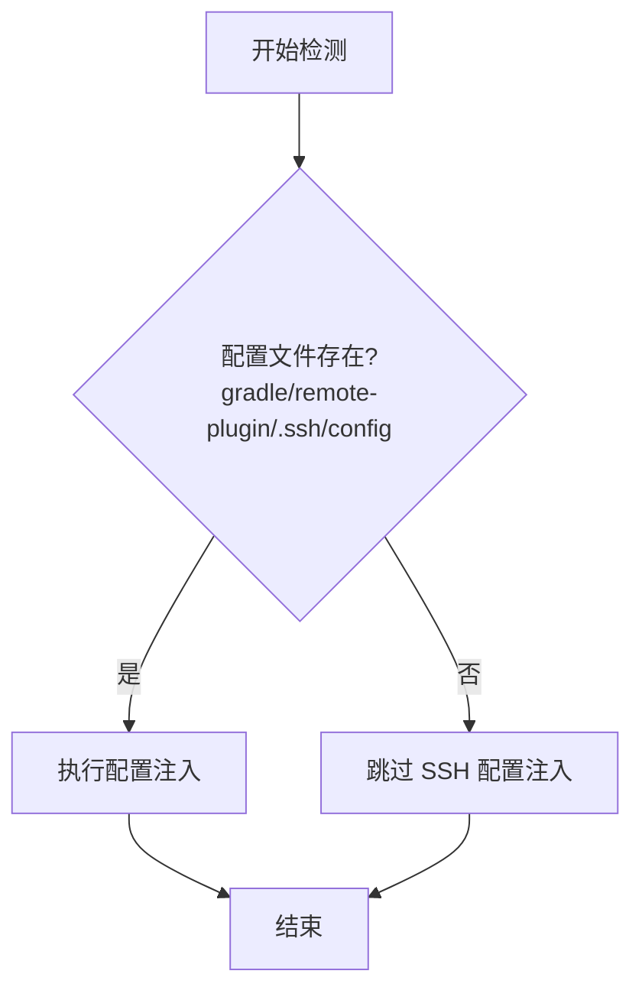

# SSH 配置路径调整设计

## 背景

当前项目中 SSH 相关的文件分散在 `gradle/remote-plugin` 目录下：
- SSH 配置文件：`gradle/remote-plugin/ssh_config`
- SSH 公钥文件：`gradle/remote-plugin/id_rsa_public`

为便于统一管理 SSH 相关文件，需要将这些文件集中到一个专门的 `.ssh` 子目录中。

## 目标

将 SSH 相关文件的存储路径调整为：
- SSH 配置文件：从 `gradle/remote-plugin/ssh_config` 迁移至 `gradle/remote-plugin/.ssh/config`
- SSH 公钥文件：从 `gradle/remote-plugin/id_rsa_public` 迁移至 `gradle/remote-plugin/.ssh/id_rsa_public`

## 设计原则

1. **集中管理**：所有 SSH 相关文件统一存放在 `.ssh` 子目录下
2. **路径规范**：使用标准的 `.ssh` 目录名，符合 SSH 配置习惯
3. **结构清晰**：SSH 相关文件集中存放，便于识别和管理
4. **最小侵入**：仅修改路径配置，不改变核心逻辑

## 影响范围分析

### 受影响的文件

| 文件路径 | 影响说明 |
|---------|---------|
| `src/main/kotlin/io/github/iuin8/remote/SshConfigManager.kt` | 需要修改 SSH 配置文件的读取路径 |
| `consumer-gradle6-sample/gradle/remote-plugin/ssh_config` | 示例文件需要迁移至新位置 |
| `consumer-gradle6-sample/gradle/remote-plugin/id_rsa_public` | 示例文件需要迁移至新位置 |
| `README.md` | 文档中的配置示例需要更新路径 |
| `README_CN.md` | 文档中的配置示例需要更新路径 |
| `docs/ssh-config-implementation.md` | 实现文档需要更新路径说明 |

### 不受影响的部分

- `remote.yml` 配置文件的位置和格式保持不变
- 系统级 SSH 配置管理逻辑（`~/.ssh/config` 和 `~/.ssh/gradle/remote-plugin/config`）保持不变
- 插件的其他功能模块不受影响

## 详细设计

### 1. 路径变更

修改 `SshConfigManager.kt` 中的路径定义：

| 项目 | 原路径 | 新路径 |
|-----|-------|-------|
| SSH 配置文件 | `gradle/remote-plugin/ssh_config` | `gradle/remote-plugin/.ssh/config` |
| SSH 公钥文件 | `gradle/remote-plugin/id_rsa_public` | `gradle/remote-plugin/.ssh/id_rsa_public` |

### 2. 配置文件检测逻辑



#### 日志提示

| 场景 | 日志级别 | 日志内容示例 |
|-----|---------|------------|
| 配置文件存在 | INFO | `[remote-plugin] 找到 SSH 配置文件：gradle/remote-plugin/.ssh/config` |
| 配置文件不存在 | INFO | `[remote-plugin] 项目未配置 SSH 配置文件，跳过 SSH 配置注入` |

### 3. 配置注入行为

1. 在 `~/.ssh/config` 中添加插件引用（首次）
2. 在 `~/.ssh/gradle/remote-plugin/config` 中添加项目的 SSH 配置文件 Include 指令
3. Include 指令使用新路径的绝对路径：`<项目根目录>/gradle/remote-plugin/.ssh/config`

### 4. 示例文件重组

调整示例项目的目录结构：

```
consumer-gradle6-sample/gradle/remote-plugin/
├── .ssh/
│   ├── config          # 原 ssh_config
│   └── id_rsa_public   # 原 id_rsa_public
└── remote.yml          # 保持不变
```

### 5. 配置文件内容调整

如果 SSH 配置文件中使用了相对路径引用 `id_rsa_public`，需要同步调整：

| 配置项 | 原内容 | 新内容 |
|-------|-------|-------|
| IdentityFile（相对路径） | `./gradle/remote-plugin/id_rsa_public` | `../gradle/remote-plugin/.ssh/id_rsa_public` |
| IdentityFile（绝对路径） | 无需调整 | 无需调整 |

### 6. 文档更新策略

#### README 文档更新要点

1. 更新配置示例中的文件路径
2. 更新 IdentityFile 路径引用说明
3. 添加路径变更说明（如有必要）

#### 配置示例调整

**旧示例（ssh_config）：**
```
位置：gradle/remote-plugin/ssh_config
IdentityFile 引用：./gradle/remote-plugin/id_rsa_public
```

**新示例（.ssh/config）：**
```
位置：gradle/remote-plugin/.ssh/config
IdentityFile 引用：../gradle/remote-plugin/.ssh/id_rsa_public
```

## 实施步骤

### 阶段一：代码修改

1. 修改 `SshConfigManager.kt`
   - 将路径常量 `gradle/remote-plugin/ssh_config` 修改为 `gradle/remote-plugin/.ssh/config`
   - 更新相关日志输出中的路径描述

2. 重组示例项目结构
   - 创建 `consumer-gradle6-sample/gradle/remote-plugin/.ssh/` 目录
   - 移动 `ssh_config` → `.ssh/config`
   - 移动 `id_rsa_public` → `.ssh/id_rsa_public`
   - 更新 `.ssh/config` 文件中的 IdentityFile 路径（如使用相对路径）

### 阶段二：文档更新

1. 更新 `README.md`
   - 修改配置示例路径
   - 修改 IdentityFile 引用路径
   - 更新配置结构说明

2. 更新 `README_CN.md`
   - 同步英文文档的修改内容
   - 确保中文表述准确

3. 更新 `docs/ssh-config-implementation.md`
   - 更新实现总结中的路径说明
   - 更新使用方式章节
   - 更新文件清单

### 阶段三：验证测试

1. 功能验证
   - 编译插件，确保无编译错误
   - 在示例项目中运行 Gradle 任务，验证 SSH 配置自动注入功能正常
   - 检查 `~/.ssh/gradle/remote-plugin/config` 中的 Include 路径是否正确

2. 文档验证
   - 检查所有文档中的路径引用是否正确
   - 验证配置示例的可用性

## 用户影响说明

由于功能刚刚实现，用户基数小，直接采用新路径即可：

1. **新用户**：直接按照新路径创建配置文件
2. **已有用户**（如有）：需手动调整文件位置
   - 创建 `gradle/remote-plugin/.ssh/` 目录
   - 移动 `ssh_config` → `.ssh/config`
   - 移动 `id_rsa_public` → `.ssh/id_rsa_public`（如有）
   - 更新配置文件中的 IdentityFile 路径引用（如使用相对路径）

## 风险评估

| 风险项 | 风险等级 | 缓解措施 |
|-------|---------|---------||
| 相对路径引用失效 | 低 | 示例文件同步更新，文档中明确说明路径调整方式 |
| 已有用户需手动调整 | 低 | 功能刚实现，用户基数小，影响面有限 |

## 成功标准

1. ✅ 新路径 `gradle/remote-plugin/.ssh/config` 能够被正确识别和处理
2. ✅ 示例项目文件重组完成，结构清晰
3. ✅ 所有相关文档更新完成，路径引用正确
4. ✅ 编译通过，功能测试通过
5. ✅ SSH 配置自动注入功能正常工作
