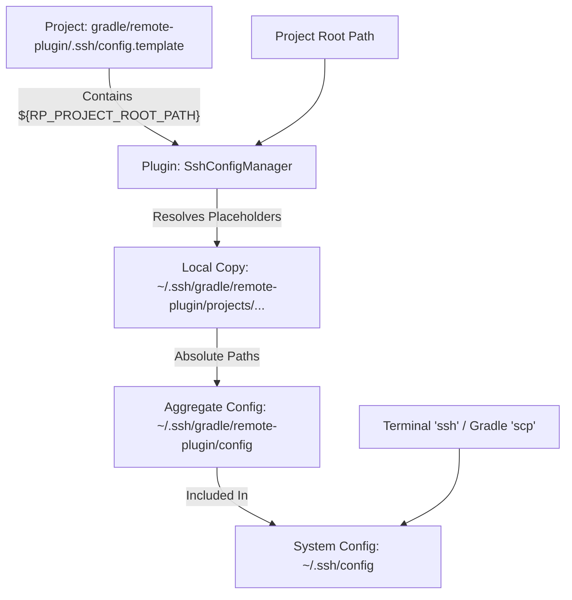

# Architecture: Portable SSH Configuration

## Concept: Shadow Resolved Config

To support portable SSH configurations while maintaining standard SSH tool compatibility, the plugin uses a "Shadow Resolved Config" mechanism.

### Data Flow

### Components

#### 1. Portable Template (`config.template`)
- Committed to Git.
- Uses `${RP_PROJECT_ROOT_PATH}` for any path involving the project root (e.g., `IdentityFile`).
- Ensures that the same file works for different developers with different checkout paths.

#### 2. Resolution Mechanism
- Triggered on plugin application.
- Extracts the absolute path of `project.rootDir`.
- Generates a local, resolved version of the config.
- Files are named with a hash of the project's absolute path to avoid collisions between projects with the same name.

#### 3. Integration Logic
- **Primary Include**: Injects `Include ~/.ssh/gradle/remote-plugin/*` into the very top of `~/.ssh/config`.
- **Secondary Include**: The aggregate file `~/.ssh/gradle/remote-plugin/config` includes all the individual project resolved configs.
- **Environment Injection**: Tasks (like `publish`) also receive `RP_PROJECT_ROOT_PATH` to handle cases where tools might try to resolve the variable themselves from the environment.

## Security & Maintainability

- **Permissions**: Automatically sets `700` for directories and `600` for config/key files.
- **Atomicity**: Uses move-to-replace strategy with `.tmp` files to prevent configuration corruption during writes.
- **Automation**: One-time setup; works "unfelt" after the first run.
